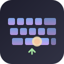

<p align="center">
  
</p>

<h1 align="center">TouchFlow Keyboard</h1>

<p align="center">
  <strong>Экранная клавиатура для сенсорного Linux</strong><br>
  Мультитач · RU/EN · Обучение · Оверлей · До входа в систему
</p>

---

## Что это

**TouchFlow** — экранная клавиатура для планшетов, киосков, панелей и 2-в-1 на Linux (Debian, Ubuntu, Fedora, Arch и др.).

При первом запуске показывается короткое обучение (один раз). Дальше — только если нажать «Показать обучение снова» в настройках.

## Установка

> **Скачать готовые сборки:** https://github.com/eturnercus/keyboard/releases

### AppImage (рекомендуется)

```bash
# Скачайте из Releases, затем:
chmod +x TouchFlow-Keyboard-1.0.0-x86_64.AppImage
./TouchFlow-Keyboard-1.0.0-x86_64.AppImage
```

> **ARM (aarch64)?** Скачайте `TouchFlow-Keyboard-*-aarch64.AppImage` или используйте shell-установщик:
> ```bash
> curl -fsSL https://github.com/eturnercus/keyboard/releases/latest/download/touchflow-install-1.0.0.sh | bash
> ```

> **Ошибка «формат выполняемого файла»?** Вы скачали x86_64 на ARM (или наоборот). Проверьте: `uname -m`

Откроется графический установщик — нажмите «Установить».

### Из исходников

```bash
git clone https://github.com/eturnercus/keyboard.git
cd keyboard
./scripts/install.sh
```

Перелогиньтесь для группы `input`.

### C++ (экспериментальная, без Python)

См. раздел **[Установка C++ 1.0.0](#установка-c-10-экспериментальная)** ниже или `./scripts/install-cpp.sh`.

### AppImage (установщик в один клик)

```bash
make appimage
# → dist/TouchFlow-Keyboard-1.0.0-x86_64.AppImage

chmod +x dist/TouchFlow-Keyboard-*.AppImage
./dist/TouchFlow-Keyboard-*.AppImage
```

AppImage откроет графический установщик: поставит зависимости, touchflowd, systemd и desktop-файлы.

### Быстрые кнопки

На клавиатуре есть ряд быстрых действий:

| Кнопка | Действие |
|--------|----------|
| Копир. | Ctrl+C |
| Встав. | Ctrl+V |
| Вырез. | Ctrl+X |
| Всё | Ctrl+A (выделить всё) |
| Отмена | Ctrl+Z |
| Повт. | Ctrl+Y |
| Поиск | Ctrl+F |

Включить/выключить: **Настройки → Раскладка → Быстрые кнопки**

### Магазины Linux

| Платформа | Команда |
|-----------|---------|
| **Flathub** | `flatpak install flathub com.touchflow.Keyboard` *(после публикации)* |
| **Snap Store** | `snap install touchflow-keyboard` *(после публикации)* |
| **.deb (Debian/Ubuntu)** | `sudo apt install ./touchflow-keyboard_1.0.0_all.deb` |

Локальная сборка пакетов:

```bash
./scripts/build-flatpak.sh   # Flatpak
./scripts/build-snap.sh      # Snap
./scripts/build-deb.sh       # .deb
make release                 # wheel + tar.gz
```

### Зависимости (если ставите вручную)

```bash
# Debian/Ubuntu
sudo apt install python3-gi gir1.2-gtk-4.0 gir1.2-adw-1 gir1.2-atspi-2.0 python3-evdev at-spi2-core

# Fedora
sudo dnf install python3-gobject gtk4 libadwaita at-spi2-core python3-evdev

# Arch
sudo pacman -S python-gobject gtk4 libadwaita at-spi2-core python-evdev
```

## Запуск

```bash
touchflowd              # демон (автостарт через systemd)
touchflow-settings      # настройки
touchflow-cli toggle    # показать/скрыть
```

## Возможности (v1.0.0)

### Языки
- **Русский** и **English** по умолчанию
- Дополнительно: Українська, Deutsch, Français
- Включение/отключение языков в **Настройки → Языки**
- Кнопка 🌐 или RU/EN на клавиатуре для переключения

### Обучение
- Запоминает, где вы скрываете клавиатуру
- **Настройки → Обучение**:
  - Порог показа (0.0–1.0)
  - Правила per-app: `always_show`, `always_hide`, `auto`
  - История по приложениям
  - Сброс обучения

### Поведение
- Авто-показ при фокусе на поле ввода
- Скрытие при подключении USB/BT клавиатуры
- Свайп снизу вверх
- Мультитач (до 10 клавиш)
- F1–F12, стрелки, numpad

### Оверлей
- Полупрозрачный джойстик и кнопки (как на телефонах)
- Редактирование позиций в настройках

### Первый запуск
- Полупрозрачное окно с 6 шагами обучения
- Показывается **только один раз**
- Повтор: **Настройки → О программе → Показать обучение снова**

### Сброс
- **Сбросить обучение** — только данные обучения
- **Сбросить настройки** — config.toml (бэкап в .bak)
- **Полный сброс** — настройки + обучение + флаг первого запуска

### Экран входа
```bash
sudo ./scripts/install-greeter.sh
sudo systemctl restart gdm   # или lightdm / sddm
```

## Настройки

`touchflow-settings` — 10 разделов:

| Раздел | Содержание |
|--------|------------|
| Поведение | Авто-показ, свайп, мультитач, внешняя клавиатура |
| **Языки** | Вкл/выкл RU, EN, UK, DE, FR; язык по умолчанию |
| **Обучение** | Порог, правила per-app, история, сброс |
| Раскладка | Высота, F-ряд, numpad |
| Шрифты | Семейство, размер |
| Цвета | 6 цветов |
| Оверлей | Джойстик, прозрачность |
| Кнопки | Физические привязки evdev |
| Экран входа | Greeter |
| О программе | Сброс, обучение снова |

Конфиг: `~/.config/touchflow/config.toml` — пример в [docs/config.example.toml](docs/config.example.toml).

### Пример: правило обучения

```toml
[[learning.rules]]
app_id = "firefox"
window_class = ""
mode = "always_hide"   # auto | always_show | always_hide
```

### Пример: добавить язык

```toml
[[languages.entries]]
code = "uk"
name = "Українська"
enabled = true
is_default = false
```

## CLI и D-Bus

```bash
touchflow-cli show
touchflow-cli hide
touchflow-cli toggle
touchflow-cli overlay
touchflow-cli reset-learning
touchflow-cli reload
```

## Сборка и тесты

```bash
pip install -e ".[dev]"
make test      # 10 тестов
make release   # dist/
```

## Установка C++ 1.0.0 (экспериментальная)

Нативный демон **`touchflowd-cpp`** — без Python в рантайме. Статус: **experimental**; основная версия — Python (`touchflowd`).

Подробности: [`experimental/touchflow-cpp/README.md`](experimental/touchflow-cpp/README.md)

| | Python 1.0.0 | C++ 1.0.0 |
|---|--------------|-----------|
| Бинарник | `touchflowd` | `touchflowd-cpp` |
| Установка | `./scripts/install.sh` | `./scripts/install-cpp.sh` |
| Настройки | `touchflow-settings` | `~/.config/touchflow/config-cpp.toml` |
| Языки | RU/EN/UK/DE/FR | RU/EN |

> Не запускайте оба демона одновременно. В KDE выберите **одну** виртуальную клавиатуру: TouchFlow (Python) или TouchFlow C++.

### AppImage (рекомендуется)

```bash
# Скачайте из Releases:
# TouchFlow-Keyboard-Cpp-1.0.0-x86_64.AppImage
chmod +x TouchFlow-Keyboard-Cpp-1.0.0-x86_64.AppImage
./TouchFlow-Keyboard-Cpp-1.0.0-x86_64.AppImage
```

Откроется графический установщик (zenity): поставит `touchflowd-cpp`, desktop-файлы для KDE и runtime GTK4.

**Shell-установщик** (без AppImage, любая архитектура):

```bash
curl -fsSL https://github.com/eturnercus/keyboard/releases/latest/download/touchflow-install-cpp-1.0.0.sh | bash
```

### Из Releases (только бинарник)

```bash
# Проверьте архитектуру
uname -m    # x86_64 или aarch64

# Скачайте touchflowd-cpp-<arch> из https://github.com/eturnercus/keyboard/releases/tag/v1.0.0
chmod +x touchflowd-cpp-x86_64
mkdir -p ~/.local/bin
mv touchflowd-cpp-x86_64 ~/.local/bin/touchflowd-cpp

# Desktop-файлы для KDE (виртуальная клавиатура)
mkdir -p ~/.local/share/applications
cp experimental/touchflow-cpp/data/*.desktop ~/.local/share/applications/
sed -i "s|Exec=touchflowd-cpp|Exec=$HOME/.local/bin/touchflowd-cpp|g" \
  ~/.local/share/applications/com.touchflow.Keyboard.*.desktop
update-desktop-database ~/.local/share/applications
```

### Из исходников (рекомендуется)

```bash
git clone https://github.com/eturnercus/keyboard.git
cd keyboard
./scripts/install-cpp.sh
```

Скрипт ставит зависимости (Debian/Ubuntu), собирает проект, копирует `touchflowd-cpp` в `~/.local/bin/`, регистрирует desktop-файлы и добавляет пользователя в группу `input`.

**Перелогиньтесь** после установки (нужна группа `input` для `/dev/uinput`).

### Ручная сборка

```bash
# Debian/Ubuntu
sudo apt install build-essential cmake pkg-config g++ \
  libgtk-4-dev libadwaita-1-dev libevdev-dev libatspi2.0-dev at-spi2-core

# Fedora
sudo dnf install gcc-c++ cmake pkg-config gtk4-devel libadwaita-devel \
  libevdev-devel at-spi2-core-devel

cd experimental/touchflow-cpp
CXX=g++ cmake -B build -DCMAKE_BUILD_TYPE=Release
cmake --build build -j$(nproc)

./build/touchflowd-cpp --version
```

### Запуск

```bash
touchflowd-cpp                    # обычный режим (авто-показ при фокусе)
touchflowd-cpp --virtual-keyboard # режим KDE/GNOME виртуальной клавиатуры
```

**KDE Wayland:** Параметры системы → Устройства ввода → Виртуальная клавиатура → **TouchFlow** (или TouchFlow C++).

Конфиг (опционально): `~/.config/touchflow/config-cpp.toml`

```toml
[behavior]
auto_show = true
hide_on_external_keyboard = true

[layout]
height_px = 280
show_quick_actions = true
```

### C++ и Python вместе

- Python: `touchflowd`, `touchflow-settings`, systemd `touchflow-daemon.service`
- C++: только `touchflowd-cpp`, без GUI-настроек
- Для продакшена на dan24 используйте **Python** (`touchflow-install-1.0.0.sh`)
- C++ — для тестов нативной сборки и сравнения производительности


## Удаление

Универсальный скрипт для **Python и C++**:

```bash
./scripts/uninstall.sh          # с подтверждением
./scripts/uninstall.sh -y       # без вопросов
./scripts/uninstall.sh -y --purge-config   # + удалить ~/.config/touchflow
```

Или: `make uninstall`

## Устранение неполадок

| Проблема | Решение |
|----------|---------|
| AppImage — ничего не происходит | Нужен GTK4: `sudo apt install python3-gi gir1.2-gtk-4.0 gir1.2-adw-1` |
| `TypeError: pressed` в journalctl | Обновите до **1.0.0** — исправлен сигнал GTK4 (`clicked`) |
| Не в списке виртуальных клавиатур (KDE) | Wayland + `./scripts/install.sh`, затем **Параметры → Устройства ввода → Виртуальная клавиатура → TouchFlow**. Перезапустите сессию или `kbuildsycoca6 --noincremental` |
| `uinput init failed` | `sudo usermod -aG input $USER` и перелогин |
| Демон не работает | `systemctl --user status touchflow-daemon` и `journalctl --user -u touchflow-daemon -e` |
| Не появляется при фокусе | `at-spi2-core`, `export GTK_MODULES=gail:atk-bridge` |
| Клавиши не вводятся | `sudo usermod -aG input $USER`, перелогин |
| Не скрывается при USB KB | Настройки → Поведение → «Скрывать при внешней клавиатуре» |
| Обучение мешает | Настройки → Обучение → правило `always_show` или сброс |
| Не работает до логина | `sudo ./scripts/install-greeter.sh` |

## Лицензия

GPL-3.0-or-later — [LICENSE](LICENSE)
